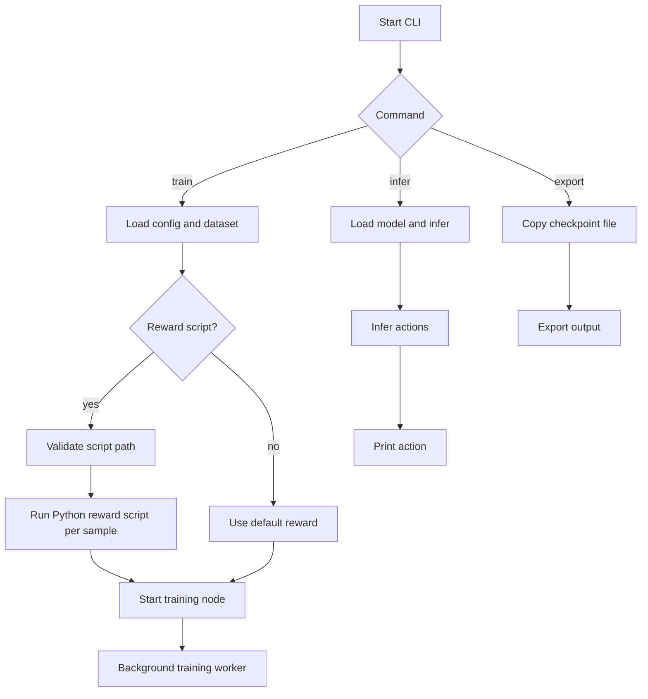

# RLT-CLI

A lightweight Rust command-line interface for Aixker-RLT model training and export workflows.

## Overview

`RLT-CLI` provides a simple CLI wrapper around AIXKER-RLT concepts for training reinforcement learning models and exporting trained artifacts.

This release adds a Python reward factory: training can now call a user-provided Python script for reward computation. The script receives feature and action data on stdin and returns JSON containing `reward` and `success`.

## CLI workflow

The `RLT-CLI` workflow is:



See `docs/cli_workflow.md` for a detailed diagram and explanation.

## Features

- `train` subcommand for starting model training
- `export` subcommand for exporting trained models
- Global options for configuration files and logging level
- Built in Rust with `clap` for command parsing

## Getting Started

### Build

```bash
cargo build --release
```

### Run

```bash
cargo run -- train --dataset ./data/train --epochs 20 --batch-size 64 --learning-rate 0.001 --model-name my-model.json
```

```bash
cargo run -- train --dataset ./data/train --epochs 20 --batch-size 64 --learning-rate 0.001 --model-name my-model.json --reward-script ./reward_script.py
```

```bash
cargo run -- infer --model-name my-model.json --features "1.0,2.0,3.0,4.0,5.0,6.0,7.0,8.0"
```

```bash
cargo run -- export --checkpoint ./checkpoints/latest.pt --output ./exported/model.json --format json
```

### Dry Run

Use `--dry-run` with `train` to validate CLI arguments and show the configured settings without actually starting training. This is useful for confirming your dataset path, hyperparameters, and model name before running a long job.

### Configuration

You can provide a TOML configuration file using `--config Config.toml` to set default values. Command-line flags will override the config file settings. See `Config.toml` for a sample configuration.

## Documentation

For detailed usage instructions, troubleshooting common errors, and more information, see the [documentation](docs/index.md).

## Project Structure

- `Cargo.toml` — Rust package manifest
- `src/main.rs` — CLI entry point and command definitions
- `copilot-instructions.md` — agent usage instructions and standards reference
- `docs/` — human-readable project documentation
- `LICENSE` — project license

## Documentation

This repository includes a `docs/` folder containing Markdown documentation for users and maintainers.

## Standards

This repository follows the `ai-agent-standards` conventions. The AI agent guidance is documented in `copilot-instructions.md`, and the shared standard files are available at:

- `https://github.com/ali-heidari/ai-agent-standards`

## License

Apache-2.0

This repository follows the `ai-agent-standards` instruction conventions. The main AI agent guidance is documented in `copilot-instructions.md`, and the shared standard files are available from the `ai-agent-standards` repository.

For more usage information, see the docs index:
- `docs/index.md`

See also:
- `copilot-instructions.md`
- `https://github.com/ali-heidari/ai-agent-standards`
