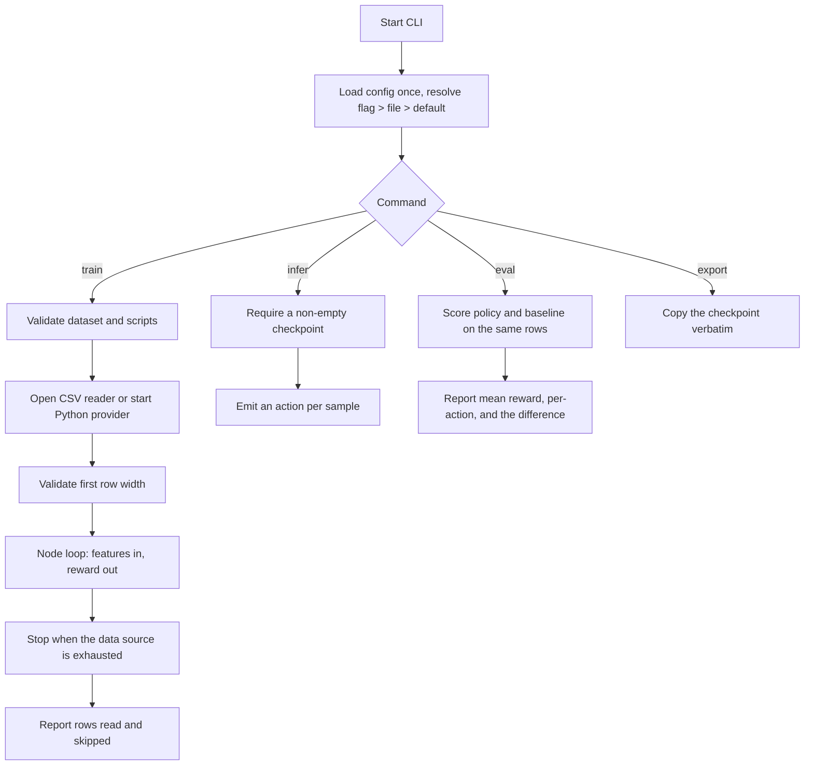

# Aixker-RLT CLI

[](https://github.com/ali-heidari/RLT-CLI/actions/workflows/ci.yml)

A lightweight Rust command-line interface for [@ali-heidari/Aixker-RLT](https://github.com/ali-heidari/Aixker-RLT) model training, inference, and export workflows.

## Quickstart

Three commands on a fresh clone, no editing and no data of your own:

```bash
cargo build --release
./target/release/rlt init      # config, reward script, heuristic, sample data
./target/release/rlt train     # asks before running the scaffolded reward script
./target/release/rlt eval --dataset ./data/holdout.csv \
  --baseline ./scripts/heuristic.py
```

`train` confirms before executing a script that the **config file** names rather
than one you typed — add `--allow-scripts` to answer in advance, or when there
is no terminal. See [Script trust](docs/usage.md#script-trust).

The last command is the one that matters — it scores the trained policy against
a plain threshold rule and tells you which won:

```text
Policy: quickstart.json          mean reward 0.3325   success 33.2%
Baseline: ./scripts/heuristic.py mean reward 0.6700   success 67.0%

Difference: -0.3375 mean reward, -33.8pp success rate
The baseline beats the policy.
```

**Yes, that says the baseline wins.** On the library revision this CLI pins, a
trained policy scores at chance on a rule a linear model should solve, and
training 30× longer does not change it. The cause is upstream and documented in
[docs/found-issues.md](docs/found-issues.md) issue 8: learning is far too weak
at the hardcoded learning rate, and inference samples from the action
distribution instead of taking the best action.

It is printed here rather than hidden because a tool that tells you your model
is not worth shipping is doing its job. See [docs/init.md](docs/init.md) for the
full walkthrough.

## Overview

`aixker-rlt-cli` installs the `rlt` command: a wrapper around Aixker-RLT for
training reinforcement learning policies, evaluating them against the heuristic
you already run, running inference, and exporting the result.

It supports two Python integration points. In both cases the script is started
**once** and exchanges one JSON line per request over its stdin/stdout:

1. **Python reward factory**: Training calls a user-provided Python script to
   compute the reward for each step. The script receives `{"features": [...],
   "action": N}` and replies `{"reward": <number>, "success": <bool>}`.

2. **Python data providers**: Training and inference can fetch feature vectors
   from a Python script on demand, for system metrics, sensors, simulations, or
   other dynamic sources.

You supply your own data; no dataset ships with this repository. `rlt init`
generates a small one so the first run needs nothing from you.

## CLI workflow

The `rlt` workflow is:



See [docs/cli_workflow.md](docs/cli_workflow.md) for a detailed diagram and explanation.

## Features

- `init` subcommand scaffolding a config, reward script, heuristic baseline, and
  sample data — a working project in one command
- `train` subcommand for starting model training
- `infer` subcommand for running inference against a trained model, emitting one
  JSON line per decision to stdout or to `--output PATH`
- `eval` subcommand for scoring a checkpoint against held-out data and comparing
  it with the heuristic you run today — see [docs/eval.md](docs/eval.md)
- `inspect` subcommand reporting a checkpoint's architecture, parameter count
  and **weight health** — diverged or non-finite weights load silently and only
  show up as poor decisions otherwise
- `export` subcommand for exporting trained models
- CPU or GPU compute via `--backend [cpu|gpu]` (CPU default; GPU via wgpu, no CUDA needed)
- Python reward factory and Python data provider integration, each backed by a
  long-lived interpreter rather than a process per sample
- CSV reading with `--has-header` and `--delimiter`, which reports unparseable
  fields by line and column instead of silently substituting `0.0`
- Clear setting precedence — flag, then config file, then default — with the
  origin of every effective value printed at the start of a run
- Global options for configuration files and logging level (`--verbose`, `--silent`, `--errors-only`, or fine-grained `--log-level`)
- Built in Rust with `clap` for command parsing

## Getting Started

Requires Rust **1.92** or newer. That floor comes from the dependency tree —
`wgpu`, pulled in by the GPU backend — not from this crate; `cargo` reports it
if your toolchain is older.

### Build (Linux / macOS)

```bash
cargo build --release
```

The binary is produced at `target/release/rlt`.

### Build (Windows)

1. Install Rust via [rustup](https://rustup.rs/) (use the default
   `x86_64-pc-windows-msvc` toolchain; it requires the
   [Visual Studio Build Tools](https://visualstudio.microsoft.com/visual-cpp-build-tools/)
   with the "Desktop development with C++" workload).
2. Build from PowerShell or `cmd`:

```powershell
cargo build --release
```

The binary is produced at `target\release\rlt.exe`:

```powershell
.\target\release\rlt.exe train --dataset .\your-data.csv --model-name my-model.json
```

Windows notes:

- **Python features** (`--dataset *.py`, `--reward-script`): install
  [Python](https://www.python.org/downloads/windows/) and check *"Add python.exe
  to PATH"* in the installer. On Windows the CLI tries the `py` launcher first,
  then `python3`, then `python`. It starts with `py` because stock Windows maps
  `python3` to a Microsoft Store alias that starts successfully and then exits —
  a stub the CLI cannot tell from a real interpreter until it fails to answer.
  If one does turn out to be a stub, the CLI moves on to the next candidate
  rather than reporting a confusing failure. **Untested:** no CI covers Windows
  yet (see the roadmap), so treat this as intent rather than a verified claim.
- **GPU backend** (`--backend gpu`): works out of the box through wgpu's DX12
  (or Vulkan) backend on NVIDIA, AMD, and Intel GPUs — no CUDA required.

#### Cross-compiling for Windows from Linux

```bash
rustup target add x86_64-pc-windows-gnu
sudo apt install mingw-w64        # Debian/Ubuntu
cargo build --release --target x86_64-pc-windows-gnu
```

The binary is produced at `target/x86_64-pc-windows-gnu/release/rlt.exe`.

### Run

Train from a CSV dataset of your own. Every column must be numeric, and the
number of columns must match `input_number` in the config file:

```bash
cargo run -- train --dataset ./your-data.csv --epochs 20 --batch-size 64 --model-name my-model.json
```

Add `--has-header` if the first line holds column names, and `--delimiter` for
anything other than a comma.

Train using a Python data provider and a Python reward script:

```bash
cargo run -- train --dataset ./scripts/system_metrics.py --epochs 20 --batch-size 64 --model-name my-model.json --reward-script ./scripts/reward_script.py
```

Run inference. Each decision is printed as a JSON line:

```bash
cargo run -- infer --dataset ./your-data.csv --model-name my-model.json
```

```text
{"row":1,"action":2}
{"row":2,"action":1}
```

Add `--with-features` to include the input that produced each decision, or
`--output actions.jsonl` to write them to a file instead of stdout. Logs go to
stderr, so the records pipe cleanly into `jq` or a downstream service.

Check whether the model is worth shipping, against the rule you run today:

```bash
cargo run -- eval --dataset ./holdout.csv --model-name my-model.json \
  --reward-script ./scripts/reward_script.py --baseline static:1
```

```text
Difference: +0.2134 mean reward, +25.2pp success rate
The policy beats the baseline.
```

Export a trained model:

```bash
cargo run -- export --output ./exported/model.json
```

Note that `--format json` **copies** the checkpoint; checkpoints are already
JSON and no conversion is performed.

### Where checkpoints live

Checkpoints are written under `./models/`. The file name currently repeats the
model name — `--model-name my-model.json` produces
`./models/my-model.json.my-model.json`. That doubling comes from the library
(see [docs/found-issues.md](docs/found-issues.md)); the CLI reports the real
path in its messages.

### Settings precedence

Command-line flag, then config file, then built-in default. Each run prints the
effective settings and where each value came from:

```text
Starting training with the following settings:
  dataset: ./your-data.csv (flag)
  model name: my-model.json (Config.toml)
  batch size: 32 (default)
```

### Choosing CPU or GPU

Training and inference run on the **CPU by default**. Add `--backend gpu` to run
the neural network on the GPU (any wgpu-supported adapter — NVIDIA, AMD, Intel,
Apple Silicon; no CUDA required):

```bash
cargo run -- train --dataset ./your-data.csv --model-name my-model.json --backend gpu
```

```bash
cargo run -- infer --dataset ./your-data.csv --model-name my-model.json --backend gpu
```

If no compatible GPU is found, the run falls back to CPU with a warning instead
of failing. The backend can also be set in the config file (`backend = "Gpu"`);
the CLI flag takes precedence. Model checkpoints are backend-agnostic — you can
train on GPU and infer on CPU with the same file.

### Dry Run

Use `--dry-run` with `train` to resolve and validate the configuration, print
it, and exit without training. It fails if the dataset or reward script is
missing, so it is a real check rather than a preview.

### Configuration

Provide a TOML configuration file with `--config Config.toml` to set defaults.
Command-line flags override it. If no `--config` is given, `Config.toml` is used
when present, and built-in defaults apply when it is not — a fresh clone runs
without any config file. See [Config.sample.toml](Config.sample.toml).

### Tests

```bash
cargo test
```

Unit tests cover CSV parsing, the data-source boundary, response parsing, the
JSONL action output, the Python worker's deadline and interpreter fallback, and
config precedence. End-to-end tests drive the built binary in a temporary
directory. The Python tests need an interpreter on `PATH`.

### Continuous integration

[`.github/workflows/ci.yml`](.github/workflows/ci.yml) runs on every push to
`develop` and on every pull request:

| Job | What it checks |
| --- | --- |
| Format and lint | `cargo fmt --all --check` and `cargo clippy --all-targets -- -D warnings` |
| Test | `cargo test --locked --all-targets` on Linux, macOS, and Windows |
| Build release | `cargo build --release --locked` on all three |

`--locked` makes the committed `Cargo.lock` authoritative, so a build that would
have needed to change it fails instead of drifting. The Windows leg matters
most: the build instructions and the Python interpreter fallback above are
claims that nothing verified before this workflow existed.

## Project Structure

- `Cargo.toml` — Rust package manifest
- `src/main.rs` — CLI entry point, config resolution, and command handlers
- `src/cli/` — command definitions and argument parsing
- `src/providers/` — CSV reader, Python provider, the long-lived Python worker,
  and the feature-source boundary that validates rows
- `src/reward_factory.rs` — Python reward script integration
- `scripts/` — sample Python reward and data-provider scripts
- `tests/` — end-to-end tests for the CLI surface
- `docs/` — human-readable project documentation
- `.agent/` — AI agent instructions and shared standards
- `LICENSE` — project license

## Documentation

For detailed usage instructions, troubleshooting, and feature guides, see the [documentation index](docs/index.md):

- [init.md](docs/init.md) — the quickstart in full
- [tutorial.md](docs/tutorial.md) — one complete story: shape data, write a
  reward, train, evaluate, export
- [recipes.md](docs/recipes.md) — autoscaling, LB weighting, cache admission,
  queue prioritisation, retry budgets
- [usage.md](docs/usage.md) — every command and flag
- [eval.md](docs/eval.md) — scoring a checkpoint against a baseline
- [cli_workflow.md](docs/cli_workflow.md)
- [reward_factory.md](docs/reward_factory.md)
- [data_providers.md](docs/data_providers.md)
- [troubleshooting.md](docs/troubleshooting.md)
- [roadmap.md](docs/roadmap.md)
- [found-issues.md](docs/found-issues.md) — issues in the upstream library

## Contributing

- [CONTRIBUTING.md](CONTRIBUTING.md) — setup, the checks CI runs, and what good
  looks like here
- [CHANGELOG.md](CHANGELOG.md) — what has changed, and the versioning policy
- [SECURITY.md](SECURITY.md) — reporting a vulnerability, and the script trust
  model, which is the one thing worth reading before running `rlt` in a
  directory you did not set up
- [CODE_OF_CONDUCT.md](CODE_OF_CONDUCT.md)

## Standards

This repository follows the `ai-agent-standards` conventions. The AI agent guidance is documented in [.agent/agent-instructions.md](.agent/agent-instructions.md), and the shared standard files are available at:

- [ali-heidari/ai-agent-standards](https://github.com/ali-heidari/ai-agent-standards)

## License

Apache-2.0
