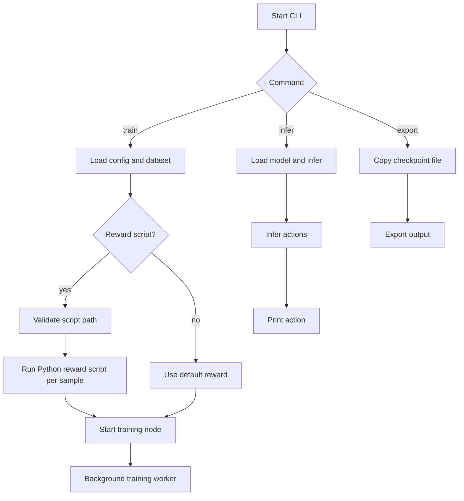

# RLT-CLI

A lightweight Rust command-line interface for [@ali-heidari/Aixker-RLT](https://github.com/ali-heidari/Aixker-RLT) model training, inference, and export workflows.

## Overview

`RLT-CLI` provides a simple CLI wrapper around AIXKER-RLT concepts for training reinforcement learning models, running inference, and exporting trained artifacts.

It supports two Python integration points:

1. **Python reward factory**: Training can call a user-provided Python script for reward computation. The script receives feature and action data on stdin and returns JSON containing `reward`.

2. **Python data providers**: Training and inference can fetch feature vectors from a Python script on demand, enabling integration with system metrics, sensors, simulations, or other dynamic data sources.

## CLI workflow

The `RLT-CLI` workflow is:



See [docs/cli_workflow.md](docs/cli_workflow.md) for a detailed diagram and explanation.

## Features

- `train` subcommand for starting model training
- `infer` subcommand for running inference against a trained model
- `export` subcommand for exporting trained models
- CPU or GPU compute via `--backend [cpu|gpu]` (CPU default; GPU via wgpu, no CUDA needed)
- Python reward factory and Python data provider integration
- Global options for configuration files and logging level (`--verbose`, `--silent`, `--errors-only`, or fine-grained `--log-level`)
- Built in Rust with `clap` for command parsing

## Getting Started

### Build (Linux / macOS)

```bash
cargo build --release
```

The binary is produced at `target/release/RLT-CLI`.

### Build (Windows)

1. Install Rust via [rustup](https://rustup.rs/) (use the default
   `x86_64-pc-windows-msvc` toolchain; it requires the
   [Visual Studio Build Tools](https://visualstudio.microsoft.com/visual-cpp-build-tools/)
   with the "Desktop development with C++" workload).
2. Build from PowerShell or `cmd`:

```powershell
cargo build --release
```

The binary is produced at `target\release\RLT-CLI.exe`:

```powershell
.\target\release\RLT-CLI.exe train --dataset .\sample-data\vmCloud_data.csv --model-name my-model.json
```

Windows notes:

- **Python features** (`--dataset *.py`, `--reward-script`): install
  [Python](https://www.python.org/downloads/windows/) and check *"Add python.exe
  to PATH"* in the installer. The CLI tries `python3` first and falls back to
  `python` automatically.
- **GPU backend** (`--backend gpu`): works out of the box through wgpu's DX12
  (or Vulkan) backend on NVIDIA, AMD, and Intel GPUs — no CUDA required.

#### Cross-compiling for Windows from Linux

```bash
rustup target add x86_64-pc-windows-gnu
sudo apt install mingw-w64        # Debian/Ubuntu
cargo build --release --target x86_64-pc-windows-gnu
```

The binary is produced at `target/x86_64-pc-windows-gnu/release/RLT-CLI.exe`.

### Run

Train from a CSV dataset:

```bash
cargo run -- train --dataset ./sample-data/vmCloud_data.csv --epochs 20 --batch-size 64 --learning-rate 0.001 --model-name my-model.json
```

Train using a Python data provider and a Python reward script:

```bash
cargo run -- train --dataset ./scripts/system_metrics.py --epochs 20 --batch-size 64 --model-name my-model.json --reward-script ./scripts/reward_script.py
```

Run inference:

```bash
cargo run -- infer --dataset ./sample-data/vmCloud_data.csv --model-name my-model.json
```

Export a trained model:

```bash
cargo run -- export --checkpoint ./checkpoints/latest.pt --output ./exported/model.json --format json
```

### Choosing CPU or GPU

Training and inference run on the **CPU by default**. Add `--backend gpu` to run
the neural network on the GPU (any wgpu-supported adapter — NVIDIA, AMD, Intel,
Apple Silicon; no CUDA required):

```bash
cargo run -- train --dataset ./sample-data/vmCloud_data.csv --model-name my-model.json --backend gpu
```

```bash
cargo run -- infer --dataset ./sample-data/vmCloud_data.csv --model-name my-model.json --backend gpu
```

If no compatible GPU is found, the run falls back to CPU with a warning instead
of failing. The backend can also be set in the config file (`backend = "Gpu"`);
the CLI flag takes precedence. Model checkpoints are backend-agnostic — you can
train on GPU and infer on CPU with the same file.

### Dry Run

Use `--dry-run` with `train` to validate CLI arguments and show the configured settings without actually starting training. This is useful for confirming your dataset path, hyperparameters, and model name before committing to a full run.

### Configuration

You can provide a TOML configuration file using `--config Config.toml` to set default values. Command-line flags override config file settings. See [Config.sample.toml](Config.sample.toml) for a sample configuration.

## Project Structure

- `Cargo.toml` — Rust package manifest
- `src/main.rs` — CLI entry point
- `src/cli/` — command definitions and argument parsing
- `src/providers/` — CSV and Python-script data providers
- `src/reward_factory.rs` — Python reward script integration
- `scripts/` — sample Python reward and data-provider scripts
- `sample-data/` — sample CSV datasets
- `docs/` — human-readable project documentation
- `.agent/` — AI agent instructions and shared standards
- `LICENSE` — project license

## Documentation

For detailed usage instructions, troubleshooting, and feature guides, see the [documentation index](docs/index.md):

- [usage.md](docs/usage.md)
- [cli_workflow.md](docs/cli_workflow.md)
- [reward_factory.md](docs/reward_factory.md)
- [data_providers.md](docs/data_providers.md)
- [troubleshooting.md](docs/troubleshooting.md)

## Standards

This repository follows the `ai-agent-standards` conventions. The AI agent guidance is documented in [.agent/agent-instructions.md](.agent/agent-instructions.md), and the shared standard files are available at:

- [ali-heidari/ai-agent-standards](https://github.com/ali-heidari/ai-agent-standards)

## License

Apache-2.0
