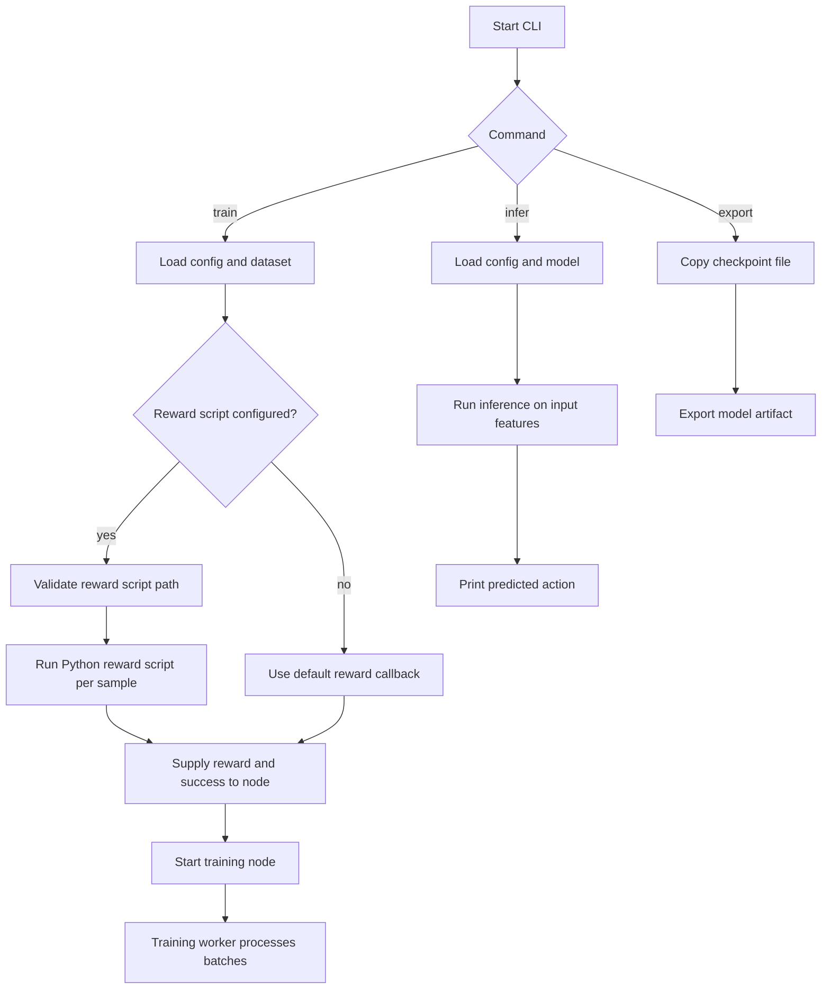

# CLI Workflow

This document explains the `RLT-CLI` command flow and how the training, inference, and export paths operate.

## Workflow Diagram

## Training path

1. `cargo run -- train` starts the CLI in training mode.
2. Configuration values are loaded from the TOML config file and command-line overrides.
3. The CSV dataset is opened and the first row is validated.
4. If `reward_script` is configured, the path is validated.
5. The reward factory executes the Python script for each sample and receives `reward` and `success`.
6. The training node is started with the configured model name.
7. A background training worker processes batches and updates the model.

## Inference path

1. `cargo run -- infer` loads the model and optionally parses input features.
2. The model produces actions from the given feature vector.
3. The CLI outputs the selected action.

## Export path

1. `cargo run -- export` copies a checkpoint file to the requested output location.
2. This path is used for packaging trained models or converting artifacts.

## Notes

- The reward script is optional. If absent, the CLI uses a default reward callback.
- If the reward script path is invalid, the CLI exits with an error before training starts.
- The `train` path additionally supports `--reward-script` and `reward_script` in `Config.toml`.
