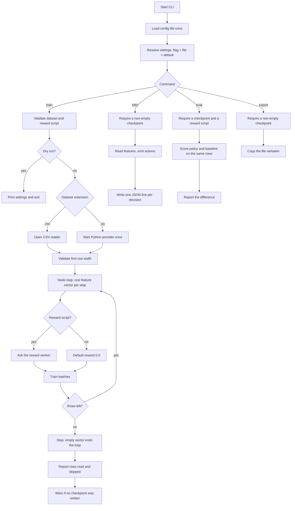

# CLI Workflow

How the `train`, `infer`, and `export` paths actually run.

## Workflow diagram

## Training path

1. The config file is read **once** into a single structure.
2. Every setting is resolved as flag > config file > built-in default, and the
   effective values are printed with their origin.
3. The dataset and reward script are validated. `--dry-run` stops here, so it
   fails on a configuration that could not run.
4. The data provider is chosen by extension: `.py` starts a Python script that
   stays running for the whole run; anything else is read as CSV.
5. The first row is read and its width checked against `input_number`. The row
   is **kept**, not discarded, so no data is lost to validation.
6. The node loop requests one feature vector per step. Rows that fail to parse
   are skipped and counted; ten consecutive failures end the run.
7. If a reward script is configured, each step exchanges one JSON line with the
   long-lived reward worker.
8. When the data source is exhausted the boundary returns an empty vector, which
   is the library's stop signal, and the run ends.
9. Rows read and skipped are reported. If the run never completed a batch, no
   checkpoint was written and the CLI says so.

## Inference path

1. The checkpoint must exist and be non-empty; otherwise the command fails
   rather than running an untrained model with random weights.
2. Features are read from the same provider types as training.
3. The model emits an action per sample. Each one is written as a JSON line to
   stdout, or to `--output PATH`. Both provider paths share the same callback,
   so neither can quietly stop reporting.
4. Records name the **data-source row**, not a count of decisions, so a skipped
   row leaves a gap rather than shifting every number after it.
5. The loop sleeps `interval_secs` between samples, which suits polling a live
   provider but is slow over a file.

## Evaluation path

1. The checkpoint must exist and be non-empty, and a reward script is
   **required** — without one every reward is `0.0` and the report would be
   zeros presented as an answer.
2. The node runs in inference mode over the held-out dataset, never sleeping
   between samples: there is nothing to wait for in a batch pass over a file.
3. For each row the reward script scores the policy's action, and — when
   `--baseline` is given — the baseline's action on the **same row**. Scoring
   them in separate passes would compare two different samples of the data.
4. The report gives mean reward, success rate and a per-action breakdown for
   each policy, plus the difference between them.

## Export path

1. The checkpoint defaults to the configured model under `./models/`.
2. It must exist and be non-empty.
3. The file is **copied verbatim** — checkpoints are already JSON and no
   conversion is performed. Output directories are created as needed.

## Notes

- Provider type is chosen by file extension (`.py`, else CSV).
- The reward script is optional; without it every reward is `0.0`.
- A failed export leaves no output file behind.
- Failures exit with status 1 and a message on stderr.
