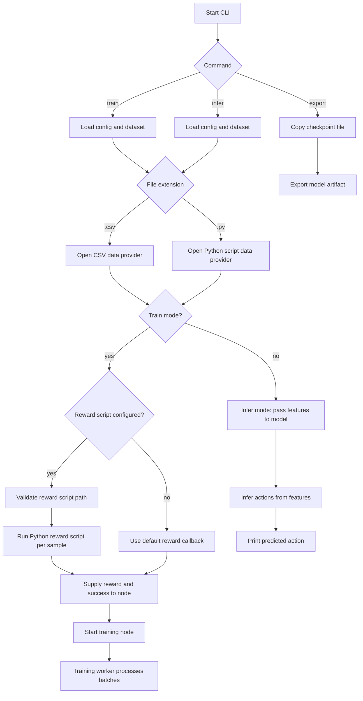

# CLI Workflow

This document explains the `RLT-CLI` command flow and how the training, inference, and export paths operate.

## Workflow Diagram

## Training path

1. `cargo run -- train` starts the CLI in training mode.
2. Configuration values are loaded from the TOML config file and command-line overrides.
3. The data source is identified by file extension:
   - `.csv`: Reads comma-separated feature vectors from a text file
   - `.py`: Calls a Python script to fetch feature vectors on demand
4. The first row/sample is validated.
5. If `reward_script` is configured, the path is validated.
6. The reward factory executes the Python reward script for each sample (if configured) and receives `reward` and `success`.
7. The training node is started with the configured model name.
8. A background training worker processes batches and updates the model.

## Inference path

1. `cargo run -- infer` loads the model for inference.
2. The data source is identified by file extension:
   - `.csv`: Reads comma-separated feature vectors from a text file
   - `.py`: Calls a Python script to fetch feature vectors on demand
3. Features are fed to the model, which outputs actions based on its learned behavior.
4. The CLI outputs the predicted action.

## Export path

1. `cargo run -- export` copies a checkpoint file to the requested output location.
2. This path is used for packaging trained models or converting artifacts.

## Notes

- The data provider type is automatically selected based on the dataset file extension (`.csv` or `.py`).
- The reward script is optional. If absent, the CLI uses a default reward callback.
- If the reward script path is invalid, the CLI exits with an error before training starts.
- If a Python data script fails or produces invalid output, the CLI exits with an error.
- The `train` path additionally supports `--reward-script` and `reward_script` in `Config.toml`.
